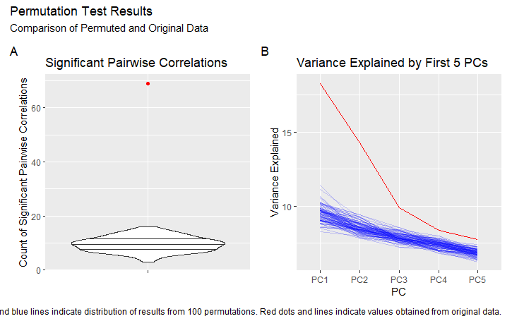

<!-- README.md is generated from README.Rmd. Please edit that file -->

# nzilbb.vowels <a href="https://joshuawilsonblack.github.io/nzilbb_vowels/"></a>

<!-- badges: start -->

[](https://github.com/JoshuaWilsonBlack/nzilbb_vowels/actions/workflows/R-CMD-check.yaml)
<!-- badges: end -->

This R package is designed to make it easier to carry out analysis of
monophthong covariation.

## Installation

You can install the development version of nzilbb.vowels from
[GitHub](https://github.com/) with:

``` r
# install.packages("devtools")
devtools::install_github("JoshuaWilsonBlack/nzilbb_vowels")
```

## Example

### `lobanov_2`

Apply Lobanov 2.0 normalisation as developed in Brand et al. (2021).
This variant of Lobanov normalisation is designed to work for datasets
whether the vowel types have different token counts from one another.
The Lobanov 2.0 value for a vowel is given by:

$$F_{lobanov2.0_i} = \frac{F_{raw_i} - \mu(\mu_{vowel_1}, \ldots, \mu_{vowel_n})}{\sigma(\mu_{vowel_1}, \ldots, \mu_{vowel_n})}$$

Where, for ease of notation, we assume all values are from a single
speaker. We signify the $n$ vowel types as $vowel_1, \ldots, vowel_2$,
while $i$ indicates the formant number. We implement the function for
$F_1$ and $F_2$.

### `pca_contrib_plot`

Take a PCA object produced by `prcomp` and plot a PC by the percentage
contribution of the original variables to the PC. For instance:


A cutoff value of 50% is given by default. This highlights the
collection of highest-contribution variables which account for 50% of
the PC in question. This can be turned off by setting `cutoff = NULL`.

The PC to plot is selected by the argument `pc_n`.

### `permutation_test`

This function runs a permutation test on a PCA analysis. Given data in a
format acceptable by `prcomp` (a data frame with all numeric columns),
the function repeats the analysis on `n` permutations of the data in
each column. It returns an S3 object with attributes:

- `$permuted_variances` `n` x `pc_no` matrix of variances explained by
  first `pc_no` PCs in `n` permutations of original data.
- `$permuted_correlations` list of length `n` of significant pairwise
  correlations in `n` permutations of the data (\<= 0.05).
- `$actual_variances` `pc_n` x 2 tibble of variances explained by first
  `pc_n` PCs with original data.
- `$actual_correlations` the number of significant pairwise correlations
  (\<= 0.05) in the original data.

### `plot_permutation_test`

Plots the results of the permutation test. If argument `violin` is set
to `FALSE`, then a the values for each permutation are connected with a
line.

For instance: 

The plots for the number of significant correlations and for variance
explained by each PC are joined together using the `patchwork` library.

*In the near future, this will be turned into a generic plot for the
`permutation_test` class*

### PCA Vowel Space Visualisation

**TODO**

### Fit Per-Vowel Models

**TODO**

### Extract By-Speaker Intercepts

**TODO**

## Packaged Data

The package includes two pairs of datasets. One is designed to allow
exploration of analysis in the style of Brand et al. (2021), the second
is designed to follow the analysis of Wilson Black et al. (2022).

1.  A sample of 100 speakers from ONZE.
    - `onze_vowels`: the mean F1 and F2 values for 100 speakers in the
      ONZE corpus, with 50 born at or before 1920 and 50 after.
    - `onze_intercepts`: random intercepts for the 100 speakers in
      `onze_means`. Intercepts generated by Brand et al. (2021).
2.  A sample of 77 speakers from QuakeBox, with 11 in each age category.
    - `qb_vowels`: vowel tokens for speaker monologues after filtering
      to remove unstressed tokens, stop words, and outliers.
    - `qb_intervals`: monologues divided into 60 and 240 second
      intervals for the same speakers as `qb_vowels`.

It is recommended to use these datasets in order to try out methods. We
do not recommend that these are directly used for research. Full
anonymised datasets are given in supplementary data for Brand et
al. (2021) and Wilson Black et al. (under review). If you are interested
in research on the basis of the ONZE or QuakeBox corpora, contact
[NZILBB](https://www.canterbury.ac.nz/nzilbb/).

## RStudio Addin

It is often useful to have Wells lexical sets in small capitals in R
Markdown documents. The way to achieve this manually is to add
“<span class="smallcaps">vowel</span>”. This package includes an RStudio
add in, which can be attached to a keyboard shortcut, to quickly include
this code within an R Markdown document. For instance:


