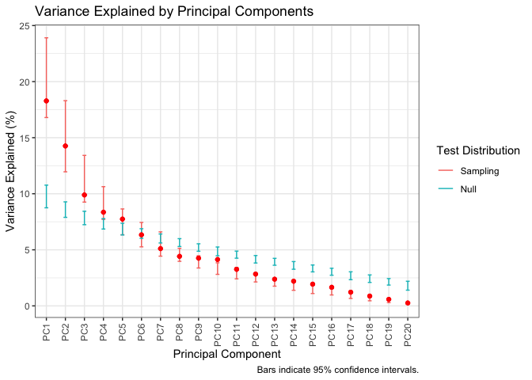
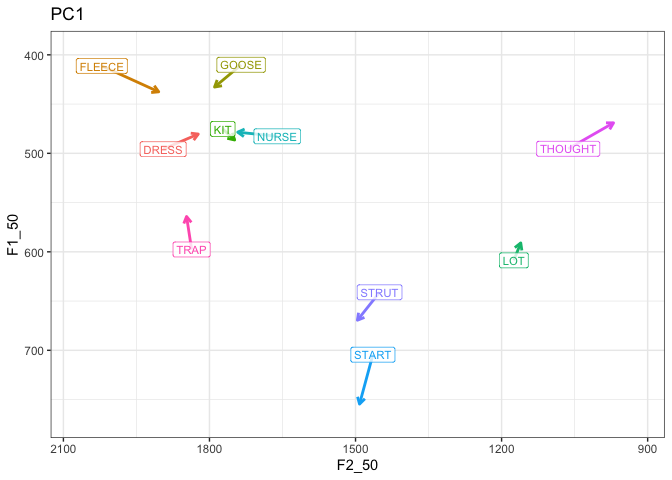
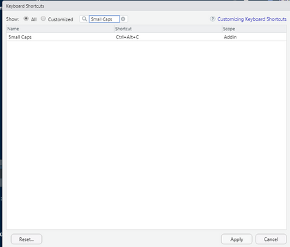

# nzilbb.vowels: Vowel Covariation Tools

The `nzilbb.vowels` packages contains useful functions and data for the
investigation of vocalic covariation. The core of the package is a set
of functions to aid PCA-based studies of monophthongs.

The package evolves along with ongoing research on vocalic covariation
carried out at
[NZILBB](https://www.canterbury.ac.nz/research/about-uc-research/research-groups-and-centres/new-zealand-institute-of-language-brain-and-behaviour).

## Installation

Install from CRAN:

``` r
install.packages('nzilbb.vowels')
```

### Development version

You can install the development version of nzilbb.vowels from
[GitHub](https://github.com/) with:

``` r
# install.packages("devtools")
devtools::install_github("nzilbb/nzilbb_vowels")
```

## Example

``` r
library(nzilbb.vowels)
#> Loading required package: patchwork
ggplot2::theme_set(ggplot2::theme_bw())

# normalise vowels using Lobanov 2.0 normalisation (see Brand et al. (2021))
onze_vowels <- onze_vowels |> 
  lobanov_2()

# apply PCA to random intercepts from GAMM models (again, from Brand et al. (2021))
onze_pca <- prcomp(
  onze_intercepts |> dplyr::select(-speaker),
  scale = TRUE
)

# Test PCA using bootstrapping approach (see Wilson Black et al. (2022))
onze_pca_test <- pca_test(onze_intercepts |> dplyr::select(-speaker))

# Plot variance explained by each PC.
plot_variance_explained(onze_pca_test)
```



``` r

# Plot index loadings of PC1
plot_loadings(onze_pca_test)
```


``` r

# Plot PC in vowel space
plot_pc_vs(onze_vowels, onze_pca_test)
```



For more information, see [Wilson Black et
al. (2022)](https://compass.onlinelibrary.wiley.com/doi/full/10.1111/lnc3.12479)
and associated [supplementary
material](https://nzilbb.github.io/PCA_method_supplementary/PCA_method_supplementary.html).

## RStudio Add-in

It is often useful to have Wells lexical sets in small capitals in R
Markdown documents. The way to achieve this manually is to add “VOWEL”.
This package includes an RStudio add in, which can be attached to a
keyboard shortcut. (see ‘Addins’ at the top of the RStudio window). This
add in works for both Quarto and RMarkdown files.


